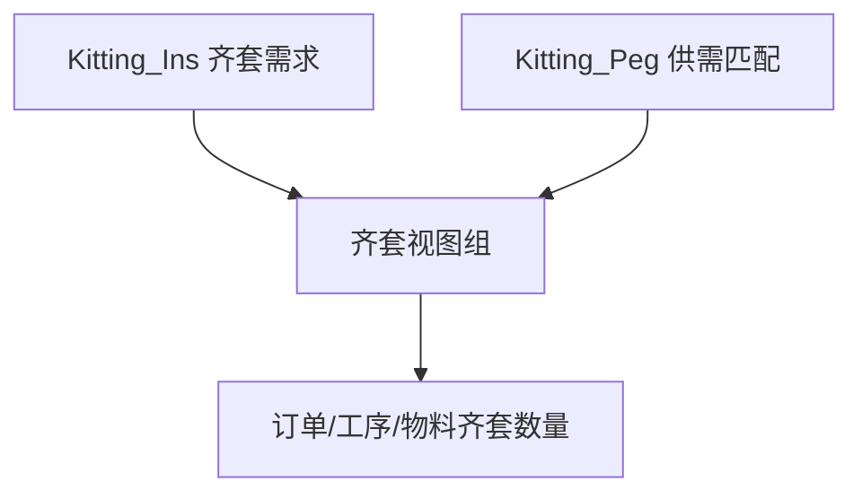

[TOC]

# 工作日志

| 日期  | 工作内容                                                     | 工作时长 |
| ----- | ------------------------------------------------------------ | -------- |
| 05/06 | ①测试MES系统的新增订单工艺BOM是否存在问题<br />②研究如何将模型中的关联表(竖向结构)转化为如图所示的横向结构 | 8h       |
| 05/07 | ①清空汉萨MES系统的标准工艺BOM总表数据，修改工时分表，重新导入工时分表并生成总表<br />②在模型中完成功能，要求显示日产量数据报表 | 8h       |
| 05/08 | ①导入工时分表<br />②汉萨MES系统资源组维护、班组维护<br />③删除汉萨MES系统的无关数据 | 7h       |
| 05/09 | ①模具定时保养模型Demo制作                                    | 4h       |
| 05/11 | ①学习模型中多个值相同且后续需要统一修改时可采用新增属性来存储和修改该值<br />②修改汉萨MES系统标准BOM总表中工序为HAS-BJ的工序有效条件为ME.Item.Stripping=='1'<br />③重新整理资源表并导入汉萨MES系统<br />④将清单中的资源的资源有效条件同步到汉萨MES系统资源表的对应资源中<br />⑤更新汉萨MES系统部分资源编号，并将旧资源备注“要弃用” | 8h       |
| 05/12 | ①汉萨MES系统数据整理及录入                                   | 7h       |
| 05/13 | ①继05/11任务<br />②删除汉萨MES系统标准工艺BOM数据，将07BOM分表excel文件、cspbom总表excel文件总表导入，CZBOM分表excel文件存在重复数据，故暂未导入<br />③修改汉萨MES系统标准BOM总表中工序为HAS-BJ的工序有效条件为ME.Item.Stripping=='1' | 7h       |
| 05/14 | ①实现制造汽车的左右车门（两个品目）的涂装工序同时开始<br />②实现不同订单按照相同规格值连续分派 | 5h       |
| 05/15 | ①汉萨CZBOM数据有误，重新制作标准BOM分表并录入系统<br />②验证换规格矩阵是否在中间品目上生效 | 8h       |
| 05/18 | ①ERP-MES数据库数据对比，验证同步逻辑<br />②协助董老师编写汉萨齐套逻辑 | 7h       |
| 05/19 | ①协助董老师编写汉萨齐套逻辑<br />②修改MES数据库的租户字段，使得相应数据在平台的常州租户中显示 | 7h       |
| 05/20 | ①汉萨MES平台上海租户创建料号级工艺BOM、订单级工艺BOM功能测试<br />②核查平台上海和常州数据是否正确 | h        |
| 05/21 | ①导入新增CSP标准工艺BOM<br />②升级汉萨服务器的Asprova软件版本 |          |
| 05/22 | ①常州物料BOM类型修改，工序编号和工序代码已补充，进行测试<br />②测试常州料号工艺BOM和订单级工艺BOM功能<br />③工艺BOM类别新增上海CTB装配，上海和常州仓库打包，并测试相关功能是否可用 |          |
| 05/25 | ①常州订单工艺BOM测试<br />②测试CSP料号工艺BOM、订单工艺BOM生成 |          |
| 05/26 | ①AsprovaMySchedule配置及测试<br />②CSP料号补充导入           |          |
| 05/27 | ①编写“汉萨MES平台-APS数据中心用户操作手册”<br />             | 8h       |
| 05/28 | ①编写并按照董老师要求修改“汉萨MES平台-APS数据中心用户操作手册”<br />②汉萨服务器多账户独立远程桌面配置 | 8h       |
| 05/29 | ①汉萨服务器数据库导入及配置，模型导入并进行模型功能测试      |          |
|       |                                                              |          |
|       |                                                              |          |
|       |                                                              |          |
|       |                                                              |          |
|       |                                                              |          |
|       |                                                              |          |
|       |                                                              |          |
|       |                                                              |          |
|       |                                                              |          |
|       |                                                              |          |
|       |                                                              |          |

# 05/06

①测试MES系统的新增订单工艺BOM是否存在问题

在MES系统的业务数据-制造订单中进行新增，新增后右侧-更多-工艺BOM管理-创建订单工艺BOM，显示品目一栏要求选择的品目已设置工艺BOM类别并且已经添加了料号级工艺BOM，所以品目一栏与展开品目一栏弄反了


②研究如何将模型中的关联表(竖向结构)转化为如图所示的横向结构

场景：产品之间关联，即成品-半成品1-半成品2-原料


订单表中为每个成品、半成品均设置了多个订单，如图所示


最终排程可在资源甘特图发现订单之间有关联


也可以通过关联表查看细节，如下图所示，产品A有两个订单001-1和001-2，产品B有两个订单002-1和002-2，其中001-1与002-1有关联，且产品A的001-1与产品B的002-1的关联数量为30，也就是001-1为002-1提供了数量为30的产品A，以此类推


上图所示的关联表为竖向结构，不够直观，要求将其转换为如下图所示的横向结构


```sql
USE	HANSAFLEX;
-- 创建订单多级关联表

-- 查看表
SELECT * FROM order_relation;
-- 删除表
DROP TABLE dbo.order_relation;
-- 插入数据
    
-- 横向订单关联视图
IF OBJECT_ID('dbo.v_order_level_tree_join', 'V') IS NOT NULL
    DROP VIEW dbo.v_order_level_tree_join;

IF OBJECT_ID('dbo.order_relation', 'U') IS NOT NULL
    DROP TABLE dbo.order_relation;
GO

CREATE TABLE dbo.order_relation (
    [Code] varchar(200),
    [Type] varchar(100),
    [LeftOrder] varchar(200),
    [Quantity] decimal(10,2),
    [RightOrder] varchar(200)
);
GO

INSERT INTO dbo.order_relation
(
    [Code],
    [Type],
    [LeftOrder],
    [Quantity],
    [RightOrder]
)
VALUES
('产品A', '品目(订单间)', '001-1', 30, '002-1'),
('产品A', '品目(订单间)', '001-2', 60, '002-2'),
('产品B', '品目(订单间)', '002-1', 20, '003-1'),
('产品B', '品目(订单间)', '002-1', 10, '003-2'),
('产品B', '品目(订单间)', '002-2', 50, '003-2'),
('产品C', '品目(订单间)', '003-1', 20, '004-1'),
('产品C', '品目(订单间)', '003-2', 5, '004-1'),
('产品C', '品目(订单间)', '003-2', 55, '004-2');
GO
```


```sql
CREATE OR ALTER VIEW v_order_relation AS
(SELECT
--取关联表的右订单作为完成品
    d1.[RightOrder] AS [L0_订单],NULL AS  [成品],NULL AS 数量,
    --第一层半成品的订单、品目、关联数量
    d1.[LeftOrder] AS  [L1_订单],d1.[Code] AS [半成品1],d1.[Quantity] AS [L1_数量],
    --第二层半成品的订单、品目、关联数量
    d2.[LeftOrder] AS  [L2_订单],d2.[Code] AS [半成品2],d2.[Quantity] AS [L2_数量],
    --第三层半成品的订单、品目、关联数量
    d3.[LeftOrder] AS  [L3_订单],d3.[Code] AS [原材料],d3.[Quantity] AS [L3_数量]
    FROM dbo.order_relation AS d1
    --关联条件：上一层表的左订单作为下一层表的右订单
    LEFT JOIN dbo.order_relation AS d2 ON d1.[LeftOrder]= d2.[RightOrder]
    LEFT JOIN dbo.order_relation AS d3 ON d2.[LeftOrder]=d3.[RightOrder]
    LEFT JOIN dbo.order_relation AS d4 ON d3.[LeftOrder]=d4.[RightOrder]
    )
    GO
    
SELECT * FROM dbo.v_order_relation;
```


```sql
--法三：法二的改进版，创建一个订单表作为主表，以解决法二获取不到成品品目和数量的痛点
--创建订单表
CREATE TABLE [Order](
    [Code] varchar(100),
    [Item] varchar(100),
    [Quantity] decimal(10,2),
    [RightmostOrder] varchar(100)-- 末端父订单
);
--删除表
DROP TABLE dbo.[Order]; 
--插入数据
INSERT INTO [Order]
VALUES
('001-1', '产品A', 30, '004-1'),
('001-1', '产品A', 30, '004-2'),
('001-2', '产品A', 60, '004-1'),
('001-2', '产品A', 60, '004-2'),
('002-1', '产品B', 30, '004-1'),
('002-1', '产品B', 30, '004-2'),
('002-2', '产品B', 60, '004-1'),
('002-2', '产品B', 60, '004-2'),
('003-1', '产品C', 20, '004-1'),
('003-2', '产品C', 60, '004-1'),
('003-2', '产品C', 60, '004-2'),
('004-1', '产品D', 25, NULL),
('004-2', '产品D', 60, NULL);

--查看Order表数据
SELECT * FROM [dbo].[Order];

--创建订单关联视图
CREATE OR ALTER VIEW v_order_relation2 AS 
SELECT  
d2.[Code] AS [L0_订单],d2.[Item] AS [完成品],d2.[Quantity] AS [L0_数量],
d3.[LeftOrder]AS [L1_订单],d3.[Code]AS [L1_半成品],d3.[Quantity]AS [L1_数量],
d4.[LeftOrder]AS [L2_订单],d4.[Code]AS [L2_半成品],d4.[Quantity]AS [L2_数量],
d5.[LeftOrder]AS [L3_订单],d5.[Code]AS [L3_半成品],d5.[Quantity]AS [L3_数量]
FROM
(SELECT 
 d1.[Code],d1.[Item],d1.[Quantity]
 FROM [dbo].[Order] d1 WHERE d1.RightmostOrder IS NULL
 )AS  d2
 LEFT JOIN dbo.order_relation d3 ON d2.[Code]=d3.[RightOrder]
 LEFT JOIN dbo.order_relation d4 ON d3.[LeftOrder]=d4.[RightOrder]
 LEFT JOIN dbo.order_relation d5 ON d4.[LeftOrder]=d5.[RightOrder]
 GO 
 SELECT * FROM v_order_relation2;
```


# 05/07

①清空汉萨MES系统的标准工艺BOM总表数据，修改工时分表，重新导入工时分表并生成总表

按照如下规则对工时表的字段进行修改


修改后工时表如下图所示


导入到汉萨MES系统中，报错


②在模型中完成功能，要求显示日产量数据报表

在模型中添加菜单，用于生成资源时序


在数据库中创建两张表，分别用于接收资源时序的开始时间和结束时间，并在模型中配置导出链接，以及配置导出编辑

```sql
CREATE DATABASE APS
GO
USE APS
GO 

-- 如果视图已存在，先删掉
IF OBJECT_ID('dbo.v_DailyOutputReport', 'V') IS NOT NULL
    DROP VIEW dbo.v_DailyOutputReport;
GO

-- 如果表已存在，先删掉
IF OBJECT_ID('dbo.ResTimeSeries_Start', 'U') IS NOT NULL
    DROP TABLE dbo.ResTimeSeries_Start;

IF OBJECT_ID('dbo.ResTimeSeries_End', 'U') IS NOT NULL
    DROP TABLE dbo.ResTimeSeries_End;
-- 创建资源时序表-开始时间
CREATE TABLE ResTimeSeries_Start(
ObjectID INT,--对象ID
Code VARCHAR(100),--资源代码
ResTime_OperationCode VARCHAR(100),--工作代码
ResTime_Type1 VARCHAR(100),--类型1
ResTime_Type2 VARCHAR(100),--类型2
ResTime_StartTime DATETIME,--开始时间
)
SELECT *FROM dbo.ResTimeSeries_Start ORDER BY ObjectID;

-- 创建资源时序表-结束时间
CREATE TABLE ResTimeSeries_End(
ObjectID INT,--对象ID
Code VARCHAR(100),--资源代码
ResTime_OperationCode VARCHAR(100),--工作代码
ResTime_Type1 VARCHAR(100),--类型1
ResTime_Type2 VARCHAR(100),--类型2
ResTime_EndTime DATETIME,--结束时间
)
SELECT *FROM dbo.ResTimeSeries_End ORDER BY ObjectID;
--DROP TABLE dbo.ResTimeSeries_Start;
--DROP TABLE dbo.ResTimeSeries_End;
```


新增类-日产量统计，添加相应字段，在数据库中创建视图，分别将两张表的开始时间和结束时间拼接到一行，便于计算分割时长。配置导入链接，分割时长、总时长、分割比率、日产量、总数字段的值使用虚拟表达式得出。

分割时长要使用函数GetWorkingTime( ME.'[开始时间]', ME.'[结束时间]',ME.'[工作]'.主资源)，直接使用`结束时间-开始时间`可能将休息时间包含进去。


```sql
GO 
CREATE VIEW dbo.v_DailyOutputReport AS 
SELECT 
    a.ObjectID,
    a.Code,
    a.ResTime_OperationCode,
    a.ResTime_StartTime,
    b.ResTime_EndTime
FROM dbo.ResTimeSeries_Start AS a
LEFT JOIN dbo.ResTimeSeries_End AS b 
    ON a.ObjectID + 1= b.ObjectID;
GO
SELECT * FROM v_DailyOutputReport ORDER BY ObjectID;
```

# 05/08

①导入工时分表

导入模板中的工序编号为文本类型，需将其改为常规类型，方可导入


将汉萨的CSP类型的标准工艺BOM总表的制造字段加上单位sp并导入汉萨MES系统的标准工艺BOM总表


②汉萨MES系统资源组维护、班组维护

将下表填入汉萨MES系统的资源表的班组字段


③删除汉萨MES系统的无关数据

删除资源表、品目表、制造订单及订单工艺BOM、修改出勤日历表、

# 05/09

  ①模具定时保养模型Demo制作

在如下图所示的制造BOM中，要求加工机模具1每使用300次就要保养6h，在该模型中实现该功能


使用计划参数设置-事件标签页，添加事件触发条件，命名为“加工机模具1保养”


添加后点击黑色箭头，编辑事件触发条件，资源选择加工机模具1，分派时间设为6h，事件订单属性设定式默认`ME.Order_Qty=1`不变，添加事件计数器，命名为“制造数量”，点击黑色箭头进入事件计数器编辑，累计式设为`ME.现工作.制造数量`，累计值的清零表达式设为`ME.累计值-300`，条件式设为`ME.事件计数器[1].累计值>=300`


排程后可发现订单表中出现事件类型的订单


资源甘特图上也可以观察到该订单的分派情况，但是存在的问题是并不是严格的加工机模具1每使用300次就保养一次，由于订单是一次性分派的，导致可能超过300次后才进行保养。


因此解决的方法是对该加工机模具1所在的工序生成的中间品进行分割，加工机磨具1所在的工序编号为20，所以对20序的中间品设置工作批量MAX最大为1。

重新排程，可发现此时是严格使用300次后就会对加工机磨具1保养一次


# 05/11

①学习模型中多个值相同且后续需要统一修改时可采用新增属性来存储和修改该值

当模型中有多个字段或多处的值需要修改为同一值时，可使用变量存储，然后使用变量来取值或改值，这样可以避免手动更改每一处的值


比方不同产品的制造BOM都拥有编号为20、30、40的工序，且不同品目的这几个工序对应的制造字段的值相同，且未来一段时间可能变更，为方便后续统一变更，可采用上述使用变量的方法。如下图所示，新增可以录入多个值的参数


在制造BOM表的品目的对应工序的制造字段上输入如下表达式，使用`ME.PROJECT`定位到项目属性上，然后再取新增参数`不同工序制造值[2]`，即取[不同工序制造值]数组的第2个参数的值。后续如果品目的30工序的制造字段的值都需要统一修改，则只修改不同工序制造值]数组的第2个参数的值即可。


②修改汉萨MES系统标准BOM总表中工序为HAS-BJ的工序有效条件为ME.Item.Stripping=='1'


③重新整理资源表并导入汉萨MES系统


④将清单中的资源的资源有效条件同步到汉萨MES系统资源表的对应资源中


⑤更新汉萨MES系统部分资源编号，并将旧资源备注“要弃用”


新的资源表如下，将其导入汉萨MES系统的资源表中


# 05/12

①汉萨MES系统数据整理及录入

- 录入07BOM、CZBOM(2)、07-csp-bom到标准工艺BOM分表中（副资源表、主副资源关系不录），且工时统一加单位sp

- 按照参数化工时表修改以上三表的工时

  


# 05/13


①继05/11任务

- 设置文件07BOM的主资源表PD|CTB-47-YB、PD|CTB-48-YB资源优先度为20、PD|CTB-21-YB的资源优先度为10（按照对应的工序CTB-DJ设置）

  > 07BOM的主资源表的每个品目的CTB-DJ工序对应4个主资源，CZBOM的主资源表的每个品目的CTB-DJ工序只对应2个主资源，资源优先度均设置为了20

- CZBOM品目新增到系统数据字典-工艺BOM类别，共新增54个，常州主资源新增到系统资源表，共新增3个，5/11资源表导入时已导入常州主资源31个。

- 换型矩阵存在的问题，系统换型矩阵以类型+资源+前+后字段为唯一标识，而所给数据中存在不同场景下但类型+资源+前+后字段相同的情况，即便换型时间不同，导入时也被认为是重复值，另外，所给换型矩阵数据中未设置优先级

②删除汉萨MES系统标准工艺BOM数据，将07BOM分表excel文件、cspbom总表excel文件总表导入，CZBOM分表excel文件存在重复数据，故暂未导入

③修改汉萨MES系统标准BOM总表中工序为HAS-BJ的工序有效条件为ME.Item.Stripping=='1'


# 05/14

①实现制造汽车的左右车门（两个品目）的涂装工序同时开始

制造BOM中设置汽车左右门品目的制造工序，其中30序为涂装工序


录入制造订单


组种类表中设置分组工作的分派方法


工序表中设置需要为工作分组的工序，将涂装工序设置为`同时开始`


在需要分组的订单上设置订单组，此处命名为组1，因此我们就完成对哪些订单的哪些工序的分派方法的设置。由于涂装工序为同时开始，左右品目涂装时间不同时，必须在全部品目都涂装完成后才能流入后工序，因此将检查工序的接续方法设置为了GES，使用GES的话，会以分组工作中最晚的制造结束时间为基准开始后工序。

将涂装机分组，并将其资源组的资源种类设为工作组，这样可在其上分派工作组，工作组以有限能力分派在资源组上。 各涂装机的【资源量制约】设为【不制约】，资源组的【资源量制约】设为【制约】。


计划参数设置：在订单展开命令后面插入一个【工作分组】命令。工作分组命令会对该时刻已生成的工作执行分组操作，并生成工作组。

项目设置中勾选【起用组分派】。


经验证，汽车左右门的两个订单数量无需相同，涂装工序也可以同时开始，只是没有同时结束而已。

②实现不同订单按照相同规格值连续分派

订单中设置统一规格的不同值


分派规则中添加添加规格1升序或降序并放置在第一行


资源评估式设为`与分派在左邻的工作的规格1相同`


# 05/15

①汉萨CZBOM数据有误，重新制作标准BOM分表并录入系统

源数据中CZBOM主资源表数据重复，主资源表和工时表数据不能够对应，重新整理数据并录入系统，新增694条标准工艺BOM，上海BOM6775条，常州BOM694条，CSPBOM6775条，共8240条数据，但系统中有8253条数据，导出标准工艺BOM总表并筛选出13条脏数据将其清除

②验证换规格矩阵是否在中间品目上生效

由于所给的换型矩阵中存在不同场景但类型+资源+前+后字段值相同的情况，因此考虑通过区分前后字段来区分不同使用场景。故需验证换规格矩阵在中间品目上是否生效。

模型中设置前设置和后设置时间为0，这样将来资源甘特图上只会有换型时间，便于验证是否换规格矩阵生效


然后使用常规订单展开命令生成中间品，并为中间品设置规格，但是注意中间品是先生成然后参与排产的，所以为20工序的资源加工机1上的中间品设置规格时，并不是加工机1加工的是产品A-10，所以规格设置在产品A-10上，而是加工机1先生成中间品产品A-20然后参与排产，所以需要设置在产品A-20上，如下图所示


设置换规格矩阵


生产日历表改为全日，便于将来在资源甘特图上观察换型时间


录入制造订单


排产如下，可看到加工机1上不同中间品之间换型时间不同，符合换规格矩阵的设定值


# 05/18

①ERP-MES数据库数据对比，验证同步逻辑


②协助董老师编写汉萨齐套逻辑



```sql
-- Kitting_Ins表用于记录工作单的每个工序需要什么物料以及单位需求量
CREATE TABLE [dbo].[Kitting_Ins](
	[ID] [INT] NULL,
	[Oper] [VARCHAR](100) NULL,
	[Item] [VARCHAR](100) NULL,
	[UQ] [DECIMAL](18, 4) NULL,
	[OrCode] [VARCHAR](100) NULL
) ON [PRIMARY]
GO
```

```sql
-- Kitting_Peg表用于记录物料供需配对，哪种类型的物料供货单把物料提供给了哪个需求单的哪个工序
CREATE TABLE [dbo].[Kitting_Peg](
	[L_Order] [VARCHAR](100) NULL,
	[L_Type] [VARCHAR](10) NULL,
	[L_Item] [VARCHAR](100) NULL,
	[PegQty] [DECIMAL](18, 4) NULL,
	[R_Order] [VARCHAR](100) NULL,
	[R_Oper] [VARCHAR](100) NULL
) ON [PRIMARY]
```


```sql
-- 视图v_Kitting_PegInv用于从表统计"库存"类型的可供给量
CREATE VIEW [dbo].[v_Kitting_PegInv] AS
SELECT R_Order,R_Oper AS Oper,L_Item AS Item,SUM(PegQty) InvQ 
FROM Kitting_Peg
WHERE L_Type='库存'
GROUP BY R_Order,R_Oper,L_Item
GO
```


# 05/19

  ①协助董老师编写汉萨齐套逻辑

```sql
-- 从Kitting_Peg表中统计"采购"+"工作单"类型的可供给量，存储到字段ERQ中
CREATE VIEW [dbo].[v_Kitting_PegER] AS
SELECT R_Order,R_Oper AS Oper,L_Item AS Item,SUM(PegQty) ERQ 
FROM Kitting_Peg
WHERE L_Type='采购' OR L_Type='工作单'
GROUP BY R_Order,R_Oper,L_Item
GO
```

```sql
-- 从Kitting_Peg表中统计总的（"库存"+采购"+"工作单"类型的）可供给量，存储到字段TQ中
CREATE VIEW [dbo].[v_Kitting_InsTQ] AS
SELECT ID,b.TQ 
FROM Kitting_Ins a INNER JOIN v_Kitting_PegTQ b ON a.Oper=b.Oper AND a.Item=b.Item AND a.OrCode=b.R_Order
GO
```

```sql
-- 将"库存"类型的可供给量关联到需求单，即该视图功能是告知物料需求表Kitting_Ins，工作单为xxx，工序为xxx，物料为xxx的这条数据对应的ID是xxx，对应的库存可供给量为xxx
CREATE VIEW [dbo].[v_Kitting_InsInvQ] AS
SELECT ID,b.InvQ 
FROM Kitting_Ins a INNER JOIN v_Kitting_PegInv b ON a.Oper=b.Oper AND a.Item=b.Item AND a.OrCode=b.R_Order
GO
```

②修改MES数据库的租户字段，使得相应数据在平台的常州租户中显示


# 05/20

①汉萨MES平台上海租户创建料号级工艺BOM、订单级工艺BOM功能测试

创建料号级BOM可在平台的料号工艺BOM总表中选择创建单个料号工艺BOM、补充缺少的料号工艺BOM、重建所有的料号工艺BOM，也可在品目表批量选中创建料号工艺BOM。


②核查平台上海和常州数据是否正确

根据之前整理的数据进行核查，两边数据已显示正确

# 05/21

①导入新增CSP标准工艺BOM

将收集的数据按照平台导入模板要求整理并导入系统中


②升级汉萨服务器的Asprova软件版本


# 05/22

①常州物料BOM类型修改，工序编号和工序代码已补充，进行测试

测试时由于平台在维护扩展字段，导致工艺BOM类别不可选，平台维护好后，测试正常


②测试常州料号工艺BOM和订单级工艺BOM功能


③工艺BOM类别新增上海CTB装配，上海和常州仓库打包，并测试相关功能是否可用

功能测试正常

# 05/25

①常州订单工艺BOM测试

②测试CSP料号工艺BOM、订单工艺BOM生成


# 05/26

①AsprovaMySchedule配置及测试<br />

更新AsprovaMySchedule插件（更新后需手动替换掉旧版的dll文件），控制面板中配置ip和端口及登陆密码然后启动，在网页端进行项目和人员授权管理，在Asprova模型的工具选项卡中进行MySchedule插件配置，输入授权的账号，连接网页端项目，上传模型排产数据后，授权人员可在网页端查看。

②CSP料号补充导入

将补充的csp料号数据整理并导入平台

# 05/27

  ①编写“汉萨MES平台-APS数据中心用户操作手册”


# 05/28

①编写并按照董老师要求修改“汉萨MES平台-APS数据中心用户操作手册”

[点击查看汉萨MES平台-APS数据中心用户操作手册](https://aps.tynote.cn/1.docx)

②汉萨服务器多账户独立远程桌面配置

为汉萨服务器配置开通多人独立远程桌面功能并设置相应账号，账户名为user，user2...user5，密码均为111

②汉萨服务器ERP、MES、APS数据库重新配置

# 05/29

  ①汉萨服务器数据库导入KL及配置，模型导入并进行模型功能测试

在汉萨服务器中配置HANSAFLEX-ERP和HANSAFLEX-MES的ODBC


然后在Adprova模型的数据表格式设定中重新配置ERP、MES、APS导入导出链接，将数据表链接到相应的ODBC或者sql server数据库


由于服务器上的Asprova软件限制工作数为50000，导入数据后删除部分数据使得工作数小于等于50000可正常使用。

除订单多级关系未配置以外，其他功能测试都正常可用


测试时发现未设定生产日历，出勤模式，平台上也未进行相关设定，添加时发现出勤模式的出勤模式字段为必填字段，不符合模型中休息时为空值的设定。平台修改后，在平台中添加汉萨相应的出勤模式和生产日历。
